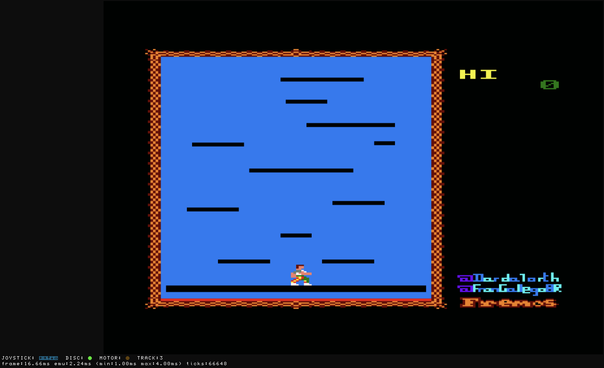
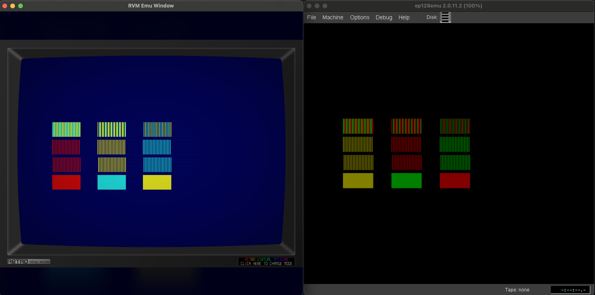

# CPCtelera Docker Build Environment

## Overview

This repository provides a way to create a Docker-based build environment for [CPCtelera](https://github.com/lronaldo/cpctelera), a C development framework for the Amstrad CPC home computer.

The primary goal is to offer a consistent and isolated build environment that works across different host operating systems, including native support for both x86_64 (amd64) and aarch64 (arm64) architectures via a multi-architecture Docker image.

This example focuses on building the `platformClimber` game, originally found in the CPCtelera examples, but the Docker image can be used to build other CPCtelera projects.

## Prerequisites

*   [Docker](https://www.docker.com/get-started) must be installed and running on your system.
*   Host machine with x86_64 (amd64) or aarch64 (arm64) architecture

## Using the Pre-built Docker Image

A pre-built multi-architecture Docker image is available on DockerHub for [CPC](https://hub.docker.com/r/braxpix/cpctelera-build-cpc) and [Enterprise](https://hub.docker.com/r/braxpix/cpctelera-build-enterprise)

### 1. Clone cpctelera project and build it using custom script

```bash
docker run -it --rm \
    -e GIT_ROOT_CREDS="https://github.com" \
    -e GIT_ROOT="https://github.com" \
    -e GIT_PROJECT_SUFFIX="baxpick/cpctelera_example" \
    -e BUILD_SCRIPT=/build/retro/projects/platformClimber/build.sh \
    -v "$(pwd)":/tmp/CPC \
    braxpix/cpctelera-build-cpc:latest
```

When container is started, [repo](https://github.com/baxpick/cpctelera_example) is cloned to `/build/retro/projects`. If you need credentials to clone repo, you need to set them in `GIT_ROOT_CREDS` variable.

Then script provided in `BUILD_SCRIPT` variable is executed.

In the end, you will have final build product `game.dsk` in your current folder since build script copies it to `/tmp/CPC` and this is mounted to your current folder.

To run the generated `game.dsk` file in a web-based emulator, see the instructions in [emulator/README.md](emulator/README.md).

Result is here:



### 2. Execute cpctelera commands locally

Create alias like this:

```bash
alias cpct='docker run --rm -v $(pwd):/hostMachine -w /hostMachine braxpix/cpctelera-build-cpc:latest'
```

Then, you can for example create cpctelera project:

```bash
cpct cpct_mkproject myGame
```

and then compile it manually:

```bash
cd myGame
cpct make
```

Note that you might need to adjust build config to comment out android part since support for it is removed to save space.

### 3. Port game to ENTERPRISE

NOTE: All credits for porting cpctelera to match Enterprise specifics, creating loader code and providing support in general go to Geco! Thanks again!

Porting cpctelera game can be tricky, but this simple example found in `box` folder is a good way to see how it works.

1. Update [build configuration](box/cfg/build_config.mk) so that CPCT_PATH is not set (docker image will setup this for you)

```bash
#CPCT_PATH      := $(THIS_FILE_PATH)../../../../cpctelera/
```

2. Update [build configuration](box/cfg/build_config.mk) so that code location is set to, for example, `0x4000` since this memory is safe to use having in mind that we will have a [loader](docker/enterprise/loader.asm) to prepare, load program binary and jump to correct program start location.

```bash
Z80CODELOC := 0x4000
```

3. From any folder execute

```
docker run -it --rm \
    -e GIT_ROOT_CREDS="https://github.com" \
    -e GIT_ROOT="https://github.com" \
    -e GIT_PROJECT_SUFFIX="baxpick/cpctelera_example" \
    -e BUILD_SCRIPT=/build/retro/projects/box/build_enterprise.sh \
    -v "$(pwd)":/tmp/OUT \
    braxpix/cpctelera-build-enterprise:latest
```

and you will get: `loader.com` and `box.bin` files which you can copy to Enterprise emulator and when executed:

```
RUN "loader.com"
```

result can be seen here:



Important things to consider when porting to Enterprise:
- you need to map colors to match yours
- FIXXXME: ...

## Notes

1. These are runtime packages installed in final image:

```docker
# Install runtime dependencies only
RUN apk add --no-cache \
    bash \
    perl \
    dos2unix \
    grep \
    coreutils \
    make \
    freeimage-dev \
    bc \
    util-linux \
    graphicsmagick \
    xxd \
    python3 \
    jq \
    git \
    file
```

Some of those are needed for cpctelera projects at compile-time but some are just convenient for me. Feel free to update this list to make your image smaller or to add packages needed for building your cpctelera project.

2. `development` branch is used when cloning cpctelera as it contains many useful stuff so if you need other branch (there have been braking changes between branches) you should update this in Dockerfile:

```docker
git clone -b BRANCH_YOU_NEED https://github.com/lronaldo/cpctelera
```

3. During building final image folder `cpctelera/tools/android` is removed to save space. If you need it, you must update Dockerfile and create your own image.